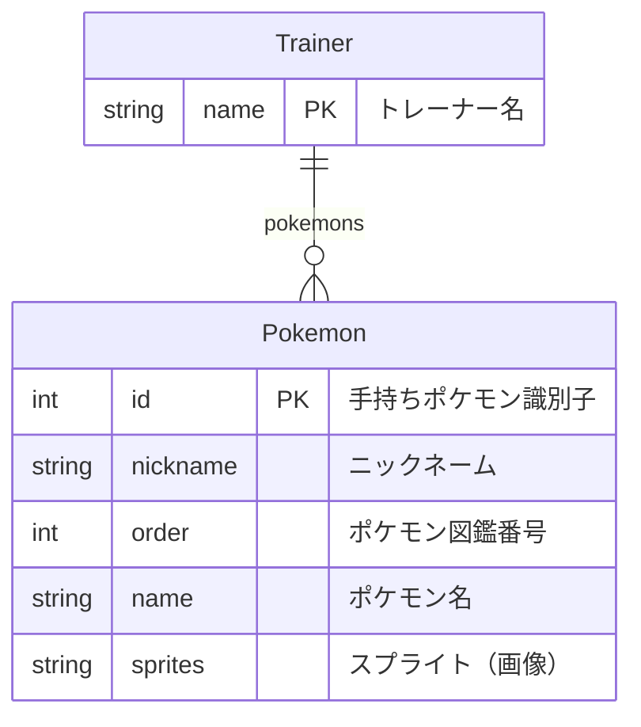

# Pokemon 

ポケモン API を使った Nuxt+Express アプリ/サーバの開発演習

## 構成図
//  
## API仕様書
//  
  
## クライアント画面構成

| 画面名               | 機能                                                                                                                   |
| :------------------- | :--------------------------------------------------------------------------------------------------------------------- |
| スタート             | 「つづきからはじめる」と「あたらしくはじめる」に遷移できる                                                             |
| あたらしくはじめる   | トレーナー名を入力してトレーナーが追加できる                                                                           |
| つづきからはじめる   | どのトレーナーを表示するか選択できる                                                                                   |
| トレーナー情報       | 「ポケモンをつかまえる」に遷移できる、ポケモンにニックネームをつけられる、ポケモンを削除できる、トレーナーを削除できる |
| ポケモンをつかまえる | ポケモンを追加できる                                                                                                   |

## ER 図



## サーバー API と AWS S3 の対応関係

| サーバー API             | AWS S3                          |
| :----------------------- | :------------------------------ |
| トレーナー名の一覧の取得 | S3 オブジェクトの一覧の取得     |
| トレーナーの追加         | S3 オブジェクトの追加または更新 |
| トレーナーの取得         | S3 オブジェクトの取得           |
| トレーナーの更新         | S3 オブジェクトの追加または更新 |
| トレーナーの削除         | S3 オブジェクトの削除           |
| ポケモンの追加           | S3 オブジェクトの追加または更新 |
| ポケモンの削除           | S3 オブジェクトの追加または更新 |

## S3 バケットに作成する S3 オブジェクトのサンプル

トレーナー情報 (トレーナーの名前や保有ポケモンのリスト) は AWS S3 のバケットの中に トレーナー名.json のような JSON ファイルとして保存します。
S3 バケット内のファイルリスト = トレーナーリストであり、トレーナーの情報は全てトレーナー名毎の JSON ファイルに含めています。

例えば、トレーナー名が `レッド` の場合は次のようになります:

- `レッド.json`: S3 オブジェクトキー（ファイル名）
- 次のコードブロック: S3 オブジェクト値（ファイル内容）

```json:レッド.json
{
  "name": "レッド",
  "pokemons": [
    {
      "id": 1,
      "nickname": "",
      "order": 35,
      "name": "pikachu",
      "sprites": {
        "front_default": "https://raw.githubusercontent.com/PokeAPI/sprites/master/sprites/pokemon/25.png"
      }
    },
    {
      "id": 2,
      "nickname": "",
      "order": 220,
      "name": "espeon",
      "sprites": {
        "front_default": "https://raw.githubusercontent.com/PokeAPI/sprites/master/sprites/pokemon/196.png"
      }
    }
  ]
}
```

## API エンドポイント

### `/api/pokeapi`

https://pokeapi.co/api/v2/ へのプロキシー

#### パラメーター

なし

#### レスポンス

https://pokeapi.co/docs/v2 に準じる

### GET `/api/trainers`

トレーナー名の一覧の取得

#### パラメーター

なし

#### レスポンス

##### 200

```json
["コジロウ", "サトシ", "ムサシ", "レッド"]
```

### POST `/api/trainer`

トレーナーの追加

#### パラメーター

なし

#### リクエストボディ

- `name`: トレーナー名（必須）
- `pokemons`: 手持ちポケモン（任意）

```json
{ "name": "satoshi" }
```

#### レスポンス

##### 200

[PutObjectCommandOutput](https://docs.aws.amazon.com/AWSJavaScriptSDK/v3/latest/clients/client-s3/interfaces/putobjectcommandoutput.html)

##### 400

空（リクエストボディに必要なプロパティが含まれていない場合に返される）

##### 409

空（すでにトレーナーが存在する場合に返される）

### GET `/api/trainer/:trainerName`

トレーナーの取得

#### パラメーター

- `trainerName`: トレーナー名

#### レスポンス

##### 200

```json
{ "name": "satoshi", "pokemons": [] }
```

### POST `/api/trainer/:trainerName`

トレーナーの更新

#### パラメーター

- `trainerName`: トレーナー名

#### リクエストボディ

- `name`: トレーナー名（必須）
- `pokemons`: 手持ちポケモン（任意）

```json
{ "name": "satoshi" }
```

#### レスポンス

##### 200

[PutObjectCommandOutput](https://docs.aws.amazon.com/AWSJavaScriptSDK/v3/latest/clients/client-s3/interfaces/putobjectcommandoutput.html)

##### 404

空（トレーナーが存在しない場合に返される）

### DELETE `/api/trainer/:trainerName`

トレーナーの削除

#### パラメーター

- `trainerName`: トレーナー名

#### レスポンス

##### 204

[DeleteObjectCommandOutput](https://docs.aws.amazon.com/AWSJavaScriptSDK/v3/latest/clients/client-s3/interfaces/deleteobjectcommandoutput.html)

### PUT `/api/trainer/:trainerName/pokemon/:pokemonName`

ポケモンの追加

#### パラメーター

- `trainerName`: トレーナー名
- `pokemonName`: ポケモン名

#### レスポンス

##### 200

[PutObjectCommandOutput](https://docs.aws.amazon.com/AWSJavaScriptSDK/v3/latest/clients/client-s3/interfaces/putobjectcommandoutput.html)

### DELETE `/api/trainer/:trainerName/pokemon/:pokemonId`

ポケモンの削除

#### パラメーター

- `trainerName`: トレーナー名
- `pokemonId`: 手持ちポケモン識別子

#### レスポンス

##### 200

[DeleteObjectCommandOutput](https://docs.aws.amazon.com/AWSJavaScriptSDK/v3/latest/clients/client-s3/interfaces/deleteobjectcommandoutput.html)
